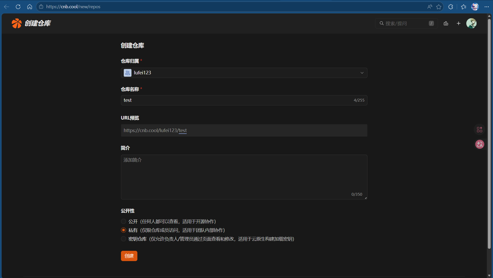
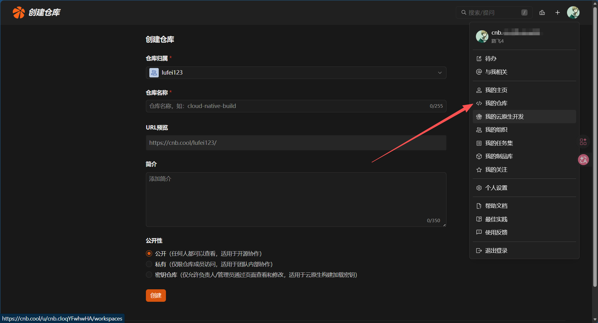
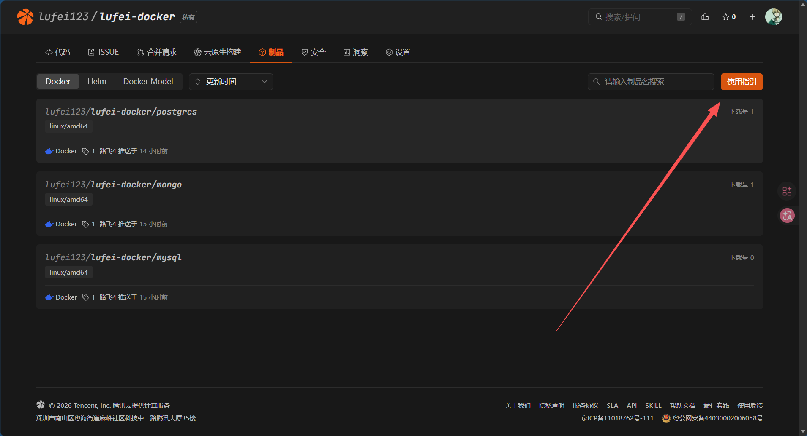
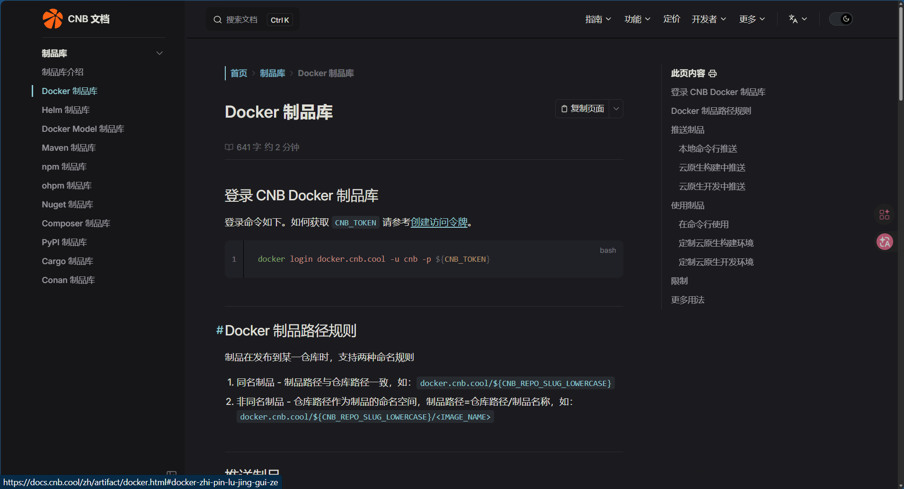
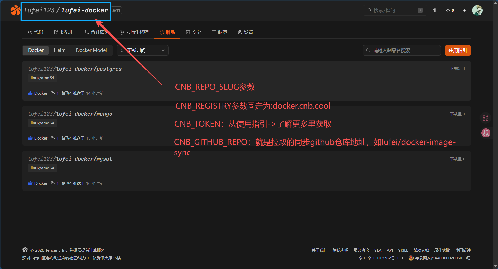
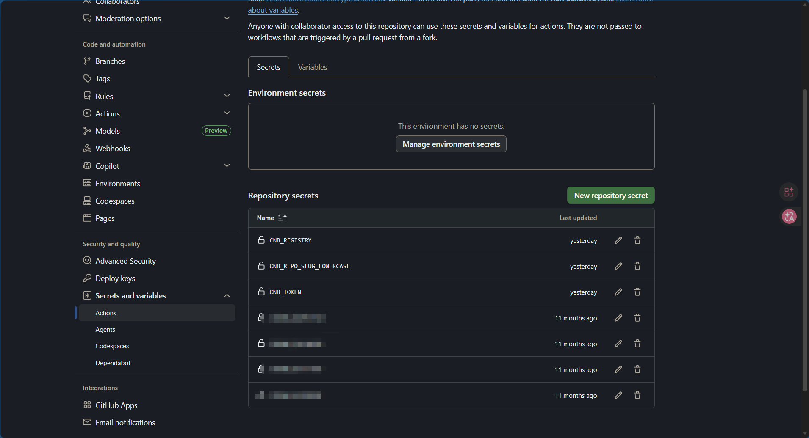
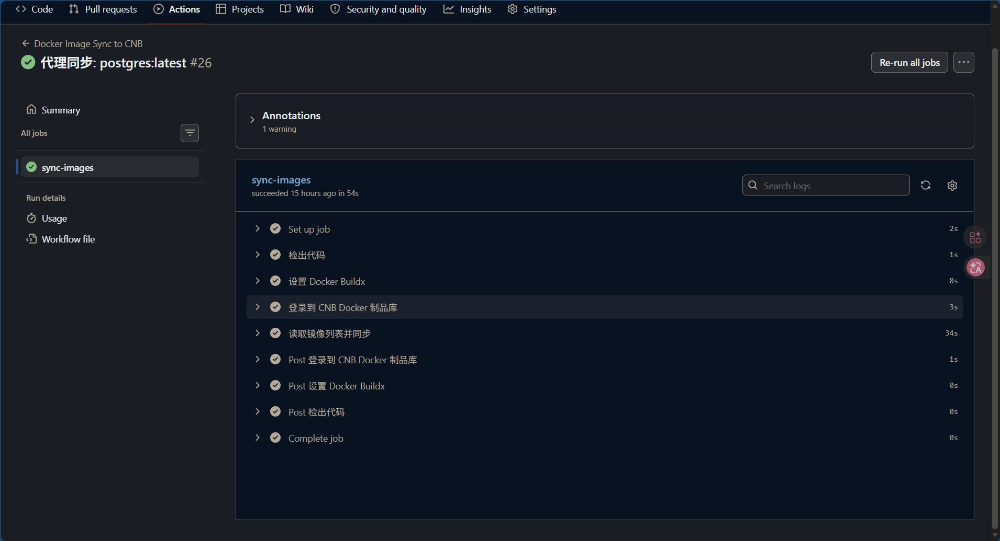

# docker-image-sync

本仓库修改自https://github.com/OnlyTL/docker-image-sync

使用 Github Action 同步Docker 镜像至cnb.cool 制品库，解决国内拉取镜像失败问题

随着国内各 Docker 镜像仓库被下，现在拉个镜像真是一言难尽，通过fork 本仓库将镜像同步至cnb.cool 制品库，来解决拉取 Docker 镜像失败问题。

# 1. 前提条件

## Coding 准备
- 注册 CNB 账号 [CNB.tool](https://cnb.cool/)
- 创建仓库

- 点击头像，然后点击我的仓库
- 
- 创建完成后，进入我的仓库，选择刚刚创建的仓库->制品，点击使用指引

- 使用指引里面有了解更多，获取当前skill所需要的CNB参数
- 

- Docker 制品仓库创建完成后，点击操作指引，可以看到针对此制品库的推送和拉取命令，其中有两个需要关注的地方，一个是仓库地址，一个是命名空间，后续会用到


# 2. Github 相关配置

- 首先需要在 github fork 下面项目,打开下面地址fork 到自己仓库
(https://github.com/lufei4/docker-image-sync)

- fork 完成后需要在自己仓库的setting中设置 3 个 变量


| Secret Name      | 说明                                  | 来源                     |
| ---------------- |-------------------------------------| ---------------------- |
| CNB_REGISTRY  | 固定值:docker.cnb.cool/               | 固定值 |
| CNB_REPO_SLUG_LOWERCASE | CNB 目标仓库（小写）如	lufei123/lufei-docker | 制品库操作指引中查找，前文提到过       |
| CNB_TOKEN  | CNB制品仓库 登录凭证                        |                        |
- 配置完成后，就可以同步镜像了
# 3. 同步及拉取
## 3.1 同步

- 回到 Github 项目代码中，点击images.txt ,编辑，输入需要同步的镜像

❗images.txt 文件中配置需要拉取的镜像，如下，表示需要同步mysql5.7和redis6.0两个镜像

```txt
mysql:5.7
redis:6.0
```

点击编辑


提交


提交完成后，就可以在 Action 中看到正在同步了...


等待同步完成后，就可以通过 CNB 拉取使用了

## 3.2 拉取

等待 Github Action 同步完成后，就可以在 CNB 制品库中看到了


1.进入 CNB 制品库，点击进入仓库，然后根据操作指引中的命令先进行登录

2.登录完成后，根据根据拉取命令拉取对应镜像对应版本就行了，也可以进入镜像中，右上角有操作指引，直接复制拉取命令也可以

